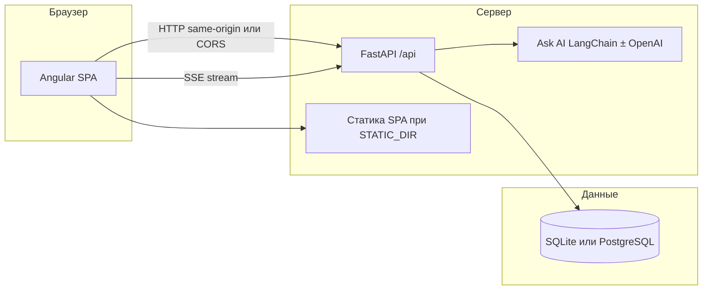

# Selling Tours

Веб-платформа для **каталога туров**, **фильтрации**, **просмотра деталей** и **оформления бронирования без оплаты** (MVP). Бэкенд отдаёт REST API и при прод-сборке может отдавать тот же SPA, что упрощает деплой одним сервисом.

**Живой деплой (Railway):** [selling-tours-production.up.railway.app](https://selling-tours-production.up.railway.app/) · [Swagger /docs](https://selling-tours-production.up.railway.app/docs)

---

## Возможности

**Для пользователя**

- Каталог туров с карточками (изображение, страна, город, цена, рейтинг, доступность мест).
- Фильтры: страна, диапазон цен, даты заезда/выезда, сортировка (цена, рейтинг, даты).
- Страница тура с описанием и формой бронирования (имя, email, дата старта, число человек).
- Раздел «Мои брони» — поиск по email.
- **Ask AI** — плавающий чат (правый нижний угол): подбор туров по тексту. С **`OPENAI_API_KEY`** ответы даёт **LangChain** + **OpenAI** с инструментами (поиск каталога, детали тура, список стран) и **SSE**‑потоком шагов («что сейчас делает агент»). Без ключа — быстрый **эвристический** подбор по тому же контракту. Виджет ведёт на страницы рекомендованных туров.

**Для разработки и эксплуатации**

- Единый контракт данных: сиды в `contracts/tours_seed.json`, описание API — `contracts/openapi.yaml`.
- Ошибки API в едином формате `{ "error": { "code", "message", "details" } }`.
- Автосид пустой БД при старте приложения.
- Юнит- и интеграционные тесты бэкенда (pytest).

---

## Архитектура



| Слой | Технологии |
| --- | --- |
| Фронтенд | **Angular 21**, **Tailwind CSS 4**, **RxJS**, lazy-loaded маршруты, `HttpClient` |
| Бэкенд | **Python 3.12**, **FastAPI**, **SQLModel**, **Pydantic Settings**, **Uvicorn**; Ask AI — **LangChain** + **langchain-openai** (при заданном `OPENAI_API_KEY`) |
| БД | **SQLite** по умолчанию; **PostgreSQL** через `DATABASE_URL` (например Docker Compose или Railway) |

---

## Структура репозитория

```
selling-tours/
├── frontend/           # SPA (Angular)
├── backend/            # API (FastAPI), тесты, Alembic
├── contracts/          # tours_seed.json, openapi.yaml
├── Dockerfile          # Полный образ: сборка фронта + API + статика (Railway и т.п.)
├── docker-compose.yml  # Postgres + backend (только API)
└── README.md
```

Маршруты SPA: `/` (каталог), `/tours/:id` (тур и бронь), `/my-bookings` (поиск брони по email).

---

## Локальный запуск

### Бэкенд (SQLite)

```bash
cd backend
python3 -m venv .venv && source .venv/bin/activate   # Windows: .venv\Scripts\activate
pip install -r requirements.txt
uvicorn app.main:app --reload --host 127.0.0.1 --port 8000
```

- API: http://127.0.0.1:8000  
- Swagger: http://127.0.0.1:8000/docs  

При первом запуске создаются таблицы и подтягиваются туры из `contracts/tours_seed.json` (если таблица пуста). Для LLM‑чата скопируйте `backend/.env.example` в `backend/.env` и при необходимости задайте **`OPENAI_API_KEY`** (не коммитьте в Git).

### Фронтенд

```bash
cd frontend
npm ci
npm start
```

Приложение: http://localhost:4200  

В `frontend/src/environments/environment.ts` задан `apiUrl: 'http://localhost:8000'` — запросы идут на локальный API.

### Postgres + бэкенд (Docker)

Из **корня** репозитория:

```bash
docker compose up --build
```

Поднимается PostgreSQL и контейнер API на порту **8000**. Переменные и путь к сиду уже заданы в `docker-compose.yml`.

---

## Переменные окружения (бэкенд)

См. `backend/.env.example`. Основное:

| Переменная | Назначение |
| --- | --- |
| `DATABASE_URL` | Строка подключения SQLAlchemy (SQLite по умолчанию или `postgresql+psycopg://...`) |
| `SEED_PATH` | Путь к JSON с турами для сида |
| `CORS_ORIGINS` | Дополнительные origin через **запятую** (к доменам для локальной разработки); для отдельного фронта на другом URL |
| `STATIC_DIR` | Каталог со собранным SPA; если задан и существует, FastAPI отдаёт статику с `html=True` (удобно для одного домена) |
| `OPENAI_API_KEY` | Ключ OpenAI: включает LLM‑ассистента в `/api/agent/chat` и SSE в `/api/agent/chat/stream`. Без него используется эвристический ответ без вызова внешних API |
| `OPENAI_MODEL` | Имя модели (например `gpt-4o-mini`); см. `backend/.env.example` |
| `PORT` | Порт HTTP (используется в корневом `Dockerfile`; Railway подставляет автоматически) |

---

## API (кратко)

Префикс **`/api`**. Примеры:

| Метод | Путь | Описание |
| --- | --- | --- |
| `GET` | `/api/health` | Проверка живости |
| `GET` | `/api/tours` | Список с фильтрами: `country`, `price_min`, `price_max`, `date_from`, `date_to`, `sort`, `page`, `size` |
| `GET` | `/api/tours/{uuid}` | Карточка тура |
| `GET` | `/api/countries` | `{ "items": ["...", ...] }` — страны из каталога |
| `POST` | `/api/bookings` | Создание брони; уменьшает `available_slots` при успехе |
| `GET` | `/api/bookings?email=` | Список броней по email |
| `POST` | `/api/agent/chat` | Тело: `{ "session_id", "message" }`; JSON с `reply` и `suggested_tour_ids` |
| `POST` | `/api/agent/chat/stream` | То же тело; ответ **`text/event-stream`** (SSE): строки `data: {...}` с `event: step` \| `done` \| `error`; финальный `done` содержит поля как у JSON‑чата |

Полная схема: **`contracts/openapi.yaml`** и интерактивно **`/docs`** (локально или на проде: […/docs](https://selling-tours-production.up.railway.app/docs)).

---

## Сборка и тесты

**Фронтенд**

```bash
cd frontend
npm run build    # production; подставляется environment.prod.ts (apiUrl '' для same-origin)
npm test         # Vitest через Angular CLI
```

**Бэкенд**

```bash
cd backend
pytest -q      # или: make test
```

---

## Деплой (Railway, один сервис)

**Текущий прод:** сервис развёрнут на [https://selling-tours-production.up.railway.app/](https://selling-tours-production.up.railway.app/) — тот же хост отдаёт SPA и API под префиксом `/api`.

Повторить деплой:

1. Подключить репозиторий к Railway.  
2. Корень проекта — **корень репозитория** (где лежит корневой **`Dockerfile`**).  
3. Сгенерировать публичный домен в настройках сервиса (**Networking**).  

Образ собирает Angular, кладёт артефакты в `/app/static`, выставляет `STATIC_DIR` и запускает Uvicorn на **`PORT`**. Запросы к API: `https://<ваш-домен>/api/...`, интерфейс — с того же хоста.

Для **постоянных броней** в проде подключите **PostgreSQL** (плагин Railway) и задайте **`DATABASE_URL`** в сервисе приложения. В контейнере с SQLite файлы БД обычно не переживают пересборку без тома.

Для **работы Ask AI с реальной моделью** в Railway задайте в сервисе секрет **`OPENAI_API_KEY`** (и при желании **`OPENAI_MODEL`**). Без них чат остаётся доступен в эвристическом режиме.

---
